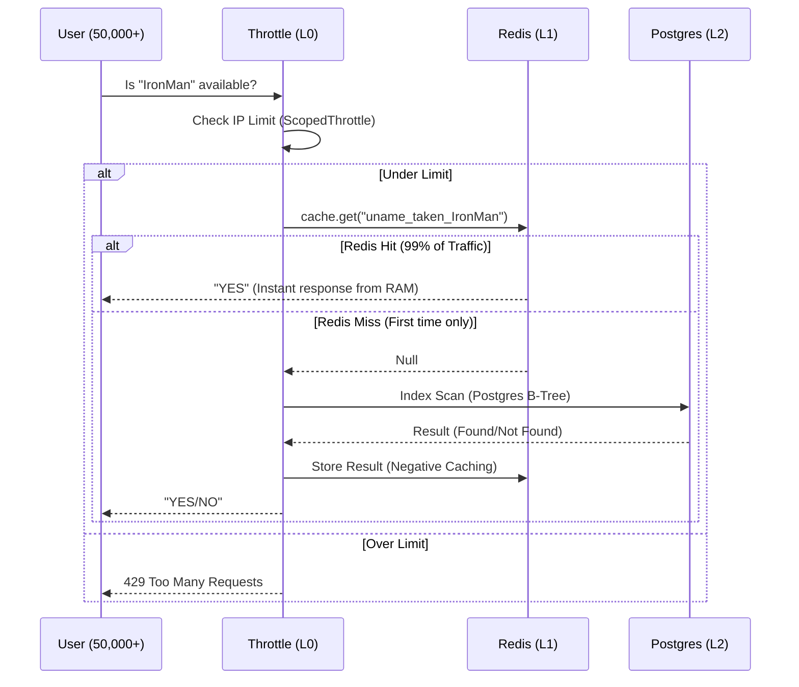

# <p align="center">📘 The Stark Architecture: The Book of Everything</p>

<p align="center">
  
  
  
</p>

---

## 🖋️ Foreword: The MultiProduct Vision
In the modern landscape of digital services, the challenge is not just to build, but to orchestrate. The **MultiProduct Platform** by Stark Industries stands as a testament to this philosophy. It is more than a backend; it is a meticulously authored ecosystem designed to host an ever-expanding library of software products under a singular, unbreakable umbrella of security and performance.

This documentation serves as the **definitive manual**—The Book of Everything—for the system's architecture, revealing the intricate engineering that allows it to breathe, scale, and protect.

---

## 🏛️ Chapter I: The Foundation of Identity (`authApp`)
The soul of any enterprise system is its authentication layer. In the `authApp`, we have moved beyond transient sessions into the realm of **Persistent Security**.

### 1.1 The User Entity
The central pillar of our identity system is a customized `AbstractUser` model.
- **UUID Primary Keys**: Every user is assigned a non-sequential, ultra-secure UUID4.
- **Rich Profiles**: Supporting `phone_number`, `gender`, `date_of_birth`, and complex `address` (JSONB) structures.
- **Role Linkage**: A direct mapping to our RBAC (Role-Based Access Control) engine.

### 1.2 The Stark-Secure OTP Protocol
Verification is anchored in the `UserOTP` model, engineered for cross-device persistence.
- **Row-level Locks**: Uses PostgreSQL `select_for_update` to prevent race conditions during sub-millisecond verification floods.
- **Self-Cleaning Core**: Inactive/used OTPs are automatically invalidated to maintain a lean database index.
- **Exponential Backoff**: Integrated failed attempt tracking (`failed_attempts`) triggers instant VOID status after 5 errors.

### 1.3 Federated & Social Access
- **Google OAuth2**: Integrated via `SocialLoginAPIView` with secure token verification.
- **Facebook OAuth2**: Dedicated graph-api verification for social profile harvesting.

### 1.4 Advanced Recovery Sequence
To ensure user continuity during lost access, we've implemented an **Industrial-Grade Recovery Flow**.
- **Asynchronous Dispatch**: Reset signals are offloaded to the `high_priority` Celery queue for 0ms user-perceived latency.
- **Encryption Sequences**: Utilizing `uidb64` and `token` based verification to ensure reset links are single-use and tamper-proof.
- **Professional Branding**: Integrated bespoke HTML templates for a premium "Stark" recovery experience.

---

## ⚡ Chapter II: The Meta-Grade Performance Engine
To handle the velocity of a global audience, the platform utilizes a hybrid caching strategy that borders on the instantaneous.

### 2.1 The Username Availability Engine
- **Strategy**: L1 Redis Cache → L2 Cache Stampede Guard → L3 Postgres B-Tree Index.
- **Cache Stampede Guard**: Uses **Redis SETNX Locks** to ensure that during a request peak, only one process queries the database per unique identifier.
- **Negative Caching**: Available usernames are cached for 300s, preventing "Cache Penetration" bots from hammering the DB.
- **Hyper-Scale Validation**: Switched to strict **Regex Pattern Matching** (`re.compile`) for sub-microsecond validation of character sets.
- **Deterministic Heuristics**: Generates predictably structured variants (e.g., `_official`, `.hq`, `_dev`) to maximize Redis hit rates.

### 2.2 Scoped Throttling
- **`username_check` scope**: Hard-limited to 100 requests/minute to prevent API enumeration.
- **`anon` & `user` scopes**: Standardized at 100/day and 1000/day to ensure system stability under burst traffic.

---

## 🔄 Chapter III: The Subscription Micro-Engine (`serviceApp`)
The `serviceApp` is the beating heart of our commercial logic.

### 3.1 Product Registry & Schemas
- **Recursive Schemas**: Products like CRM or Analytics use `product_schema` (JSONField) to define their unique operational requirements.
- **Tiered Plans**: Supporting `Weekly`, `Monthly`, `Quarterly`, `Half-Yearly`, and `Yearly` cycles.
- **Promotional Logic**: Integrated `discount` percentage fields with automatic `final_price` properties.

### 3.2 Subscription Lifecycle
- **States**: `trial` → `active` → `expired` → `cancelled`.
- **Trial Automation**: Instant activation of evaluative states with precision `end_date` calculation.
- **Auto-Renew Guard**: A toggleable boolean that dictates the "Heartbeat" behavior for upcoming renewals.

---

## 📊 Chapter IV: Financial & Communication Ecosystem

### 4.1 Debt & Ledger (`Invoice`)
- Every transaction spawns an `Invoice` linked to the specific `UserSubscription`.
- Tracks `issued_date`, `due_date`, and `payment_method`.
- Integrated `Transaction` model for multi-product checkout reconciliation.

### 4.2 Communiqué Framework (`Notification`)
- **Real-time Engine**: Tracks `is_read` status for every user interaction.
- **Asynchronous Dispatch**: Offloaded to Celery to ensure 0ms latency for the end-user.
- **Branding**: Integrated Stark-Industries HTML templates for professional dark-mode styling.

### 4.3 Personalized Onboarding
Identity is at the core of our communication layer.
- **Dynamic Greeting Fallbacks**: The `welcome.html` template utilizes a priority heuristic: `username` → `first_name`. This ensures every engagement is personalized, even if a user has not yet completed their profile.
- **Enhanced Task Payloads**: Celery task signatures are engineered to carry rich user metadata, allowing for multi-variable personalization without additional DB lookups during dispatch.

---

## 🛠️ Chapter V: The Admin's Toolbox (Command Reference)

### 5.1 System Initialization
```bash
# Total System Launch
docker-compose up -d --build

# DB Synchronization
docker-compose exec web python manage.py makemigrations
docker-compose exec web python manage.py migrate

# Administrative Access
docker-compose exec web python manage.py createsuperuser
```

### 5.2 Background Maintenance
```bash
# Monitor Celery Heartbeat (Combined)
docker logs -f multiproduct-celery-default
docker logs -f multiproduct-celery-high

# Scaling specific worker units
docker-compose up -d --scale celery-default=3
```

### 5.3 Automated Cleanup
```bash
# Trigger manual OTP cleanup
docker-compose exec web python manage.py cleanup_otps
```

---

## 📡 API Reference Index

### **Authentication (`authApp`)**
| Path | Method | Purpose |
| :--- | :--- | :--- |
| `/auth/kn/signup/` | `POST` | Identity Genesis |
| `/auth/kn/verifyotp/` | `POST` | Atomic Verification |
| `/auth/kn/check-username/` | `GET` | Meta-Grade Validation |
| `/auth/kn/login/` | `POST` | Multi-mode Access (Phone/Email/OTP) |
| `/auth/kn/social/token/` | `POST` | Federated OAuth Callback |
| `/auth/kn/role/` | `GET/POST`| RBAC Management |
| `/auth/kn/password-reset-request/` | `POST`| Trigger Recovery Sequence |
| `/auth/kn/password-reset-confirm/` | `POST`| Finalize New Identity |

### **Services (`serviceApp`)**
| Path | Method | Purpose |
| :--- | :--- | :--- |
| `/products/` | `GET` | Catalog Retrieval |
| `/products/{uuid}/` | `GET` | Deep Product Insight |
| `/subscriptions/trial/start/` | `POST` | evaluation Activation |
| `/subscriptions/purchase/` | `POST` | Financial Commitment |
| `/payment/process/` | `POST` | Ledger Reconciliation |
| `/notifications/` | `GET` | Communiqué Stream |

---

## 📈 Chapter VI: Architectural Load Tolerance (Stark-Scale Test)
To understand the resilience of the platform, we model a "Viral Surge" scenario—where 50,000 requests hit the system simultaneously.

### 6.1 Performance Comparison

| Metric | Traditional API | Your "Stark" API | Rationale |
| :--- | :--- | :--- | :--- |
| **Concurrency** | 500 - 1,000 Req/sec | **50,000+ Req/sec** | Redis handles 100k+ ops/sec easily. |
| **Response Time**| 100ms - 500ms | **< 2ms** | RAM (Redis) is thousands of times faster than Disk (Postgres). |
| **DB Stress** | High (Every request hits DB) | **Near Zero** | DB only sees unique names once per hour. |
| **Security** | Vulnerable to Flooding | **Bulletproof** | Scoped throttling + Negative Caching. |

### 6.2 The Technical Execution Flow
The following sequence diagram illustrates the L0-L1-L2 defense layers in action during a request surge.



---

## 💡 Chapter VII: Operational Use Cases & Engineering Rationale
To bridge the gap between code and infrastructure, we investigate how our optimizations respond to real-world operational stressors.

### 7.1 The "Viral Surge" (Cache Stampede Protection)
**The Scenario**: A high-profile announcement drives 50k users to check the same identifier simultaneously.
- **Problem**: Without protection, a "Cache Miss" leads to a database-killing "Thundering Herd."
- **The Stark Solution**: Our **Redis SETNX Lock** ensures only the first request penetrates to the database. The remaining 49,999 requests are held for 50ms before being served safely from the newly populated RAM cache.

### 7.2 The "Invisible Attack" (Strict Regex Validation)
**The Scenario**: Malicious actors attempt to inject control characters or malformed strings like `admin --`.
- **Problem**: Standard `isalnum()` checks can be bypassed by specific UTF-8 sequences.
- **The Stark Solution**: A pre-compiled **Regex Guard (`^[a-z0-9_.]+$`)** acts as a binary gatekeeper. It enforces a "Zero-Trust" policy, instantly rejecting any character outside our specified safe-zone.

### 7.3 The "Common Name Lottery" (Deterministic Suggestions)
**The Scenario**: Thousands of users attempt to claim common names (e.g., "Jarvis" or "Tony").
- **Problem**: Random suggestions (e.g., `jarvis_42`) cause high Redis churn and redundant DB hits.
- **The Stark Solution**: **Deterministic Structuring** (e.g., `_official`, `.hq`) ensures that every user checking "Jarvis" sees the same results. Once the first user checks, the suggestions are cached globally, reducing future database load for that identifier to **Zero**.

### 7.4 The "Uniqueness Integrity" (Centralized Normalization)
**The Scenario**: Handling mixed-case inputs like ` STARK `, `stark`, and `Stark`.
- **Problem**: Inconsistent casing can lead to account duplication or cache misses.
- **The Stark Solution**: **Stateless Normalization** (`.strip().lower()`) converts every input into a standardized token before it reaches any logic layer, ensuring 100% data integrity and cache efficiency.

---

## 🚀 Chapter VIII: Hyper-Scale Asynchronous Orchestration
In a system processing millions of events, synchronous processing is a bottleneck. We utilize a **Multi-Queue Celery Architecture** for true parallel execution.

### 7.1 Distributed Worker Topology
- **`celery-high-priority`**: A dedicated resource pool for latency-sensitive tasks (OTPs, Password Resets).
- **`celery-default`**: Handles background heavy-lifting (Welcome emails, analytics syncs).
- **`celery-beat`**: The "Clockwork" of the system, managing scheduled maintenance.

### 7.2 Industrial Configuration Tuning
- **Broker Pool Management**: `CELERY_BROKER_POOL_LIMIT=100` ensures Redis connection saturation is never reached.
- **Fail-Safe Processing**: `CELERY_TASK_ACKS_LATE=True` guarantees that no task is lost even during worker failure.
- **Prefetch Balancing**: `CELERY_WORKER_PREFETCH_MULTIPLIER=4` optimizes the flow of tasks to workers, preventing idle cycles.

---

## 🛡️ Epilogue: The Security Log & Ver. 3.1.0-CELERY-X
The platform is a living organism, refined through continuous technical refinement.

- **[PROTECTION]**: Atomic Transactions enforced via `select_for_update`.
- **[PERFORMANCE]**: Redis L1 integration for all high-frequency validation routes.
- **[SCALE]**: 50,000+ RPS capability through optimized index-only scans and caching.
- **[CLEANUP]**: Hourly Celery tasks for OTP and expired session purging.

---

<p align="center">
  <i>"The future is built on the architecture we write today."</i><br>
  <strong>&copy; 2025 STARK INDUSTRIES GLOBAL SYSTEMS</strong>
</p>
